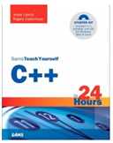

```
Roberto Nogueira  BSd EE, MSd CE
Solution Integrator Experienced - Certified by Ericsson
```

# C++ in 24 hours



## Table of Contents

```
Part I: Beginning C++
[x] Hour 1. Writing Your First Program
[x] Hour 2. Organizing the Parts of a Program
[x] Hour 3. Creating Variables and Constants
[x] Hour 4. Using Expressions, Statements, and Operators
[x] Hour 5. Calling Functions
[x] Hour 6. Controlling the Flow of a Program
[x] Hour 7. Storing Information in Arrays and Strings
Part II: Classes
[x] Hour 8. Creating Basic Classes
[ ] Hour 9. Moving into Advanced Classes
Part III: Memory Management
[ ] Hour 10. Creating Pointers
[ ] Hour 11. Developing Advanced Pointers
[ ] Hour 12. Creating References
[ ] Hour 13. Developing Advanced References and Pointers
Part IV: Advanced C++
[ ] Hour 14. Calling Advanced Functions
[ ] Hour 15. Using Operator Overloading
Part V: Inheritance and Polymorphism
[ ] Hour 16. Extending Classes with Inheritance
[ ] Hour 17. Using Polymorphism and Derived Classes
[ ] Hour 18. Making Use of Advanced Polymorphism
[ ] Hour 19. Storing Information in Linked Lists
Part VI: Special Topics
[ ] Hour 20. Using Special Classes, Functions, and Pointers
[ ] Hour 21. Using New Features of C++0x
[ ] Hour 22. Employing Object-Oriented Analysis and Design
[ ] Hour 23. Creating Templates
[ ] Hour 24. Dealing with Exceptions and Error Handling
Part VII: Appendices
[ ] Appendix A. Binary and Hexadecimal
[ ] Glossary
[ ] Appendix C. This Book’s Website
Index
```
